# Spot On
# Spot On: A blend of GIS and LLMs(Gemini)

Spot On is an advanced, AI-assisted land suitability analysis platform. Built with **Streamlit**, **PostGIS**, **PyLUSAT**, and **Google Gemini**, it identifies suitable locations using user defined spatial criteria, proximity analysis, and dynamic AI reasoning. The idea was to blend GIS with AI and create something thateven non experts can use easily. 

> “Find the best spot, based on your thoughts.”

---


## 🚀 About Spot On


---

## 🚀 Features

- 📍 **Multi-Criteria Weighted Overlay Analysis**
- 🧠 **LLM-Powered Prompt Parsing** (via Google Gemini)
- 📊 **Distance-Based Raster Processing**
- 🧾 **PDF Report Generation with Maps & Explanations**
- 🗂️ **Layer Management from PostGIS Database**
- 🧭 **Top Site Extraction with Real-World Geocoding**
- 🌐 **Interactive Leaflet Maps (via Folium)**
- 🖼️ **Matplotlib Suitability Visualizations**

---


## 🛠️ Tech Stack

- **Backend**: Python, Streamlit, GeoPandas, Rasterio, SQLAlchemy
- **Database**: PostgreSQL + PostGIS
- **AI Engine**: Google Gemini (`gemini-2.0-flash`)
- **Spatial Processing**: PyLUSAT, GDAL
- **Visualization**: Matplotlib, Folium, ReportLab
- **Geocoding**: Nominatim (OpenStreetMap)

---


---

### 💬 Define Criteria Using Prompt
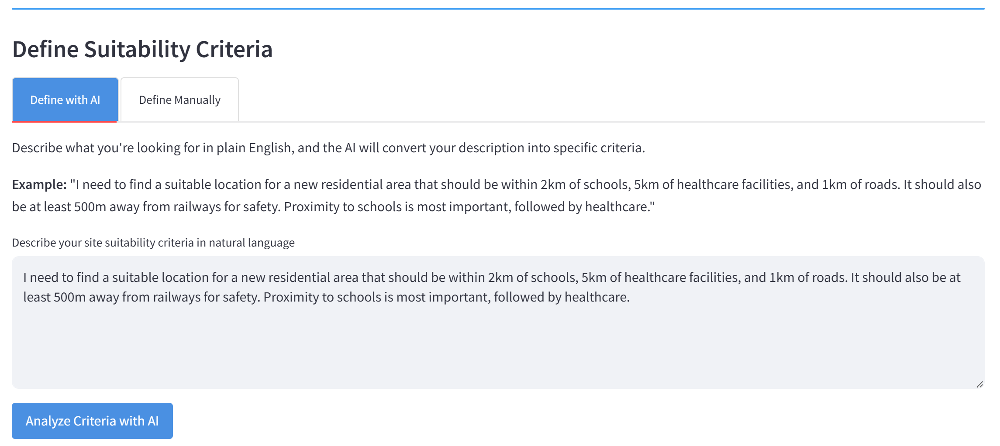

### 🧠 Identified Spatial Layers (AI Parsed)
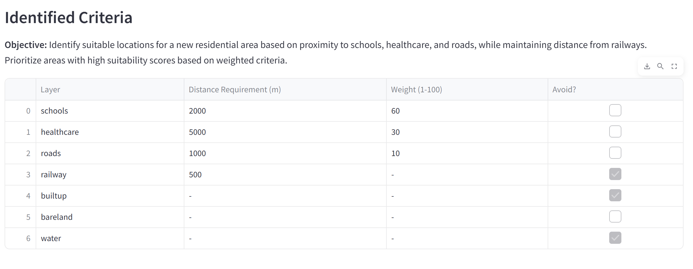

### 🗃️ Loading Spatial Data from Database
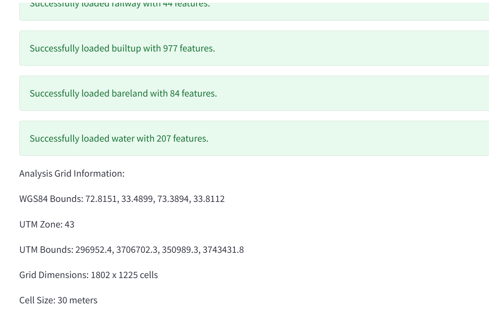

### ⚙️ Analysis Result (Weighted Overlay)
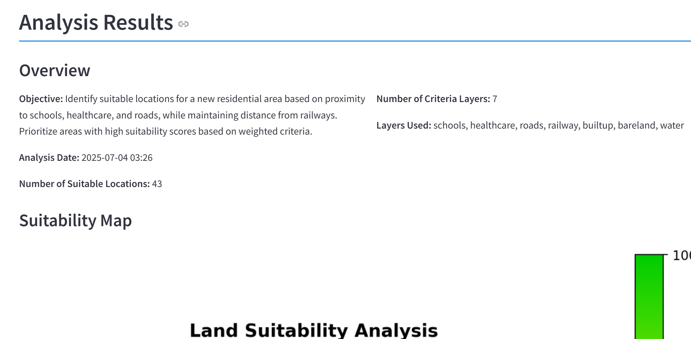

### 🗺️ Suitability Map Output
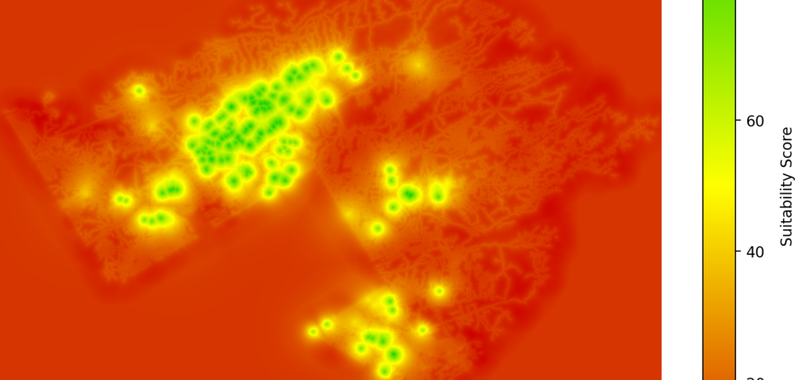

### 📍 Top Suitable Locations (Ranked)
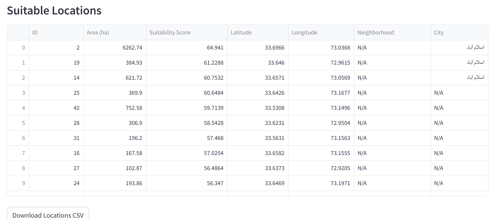

### 🌐 Interactive Leaflet Map
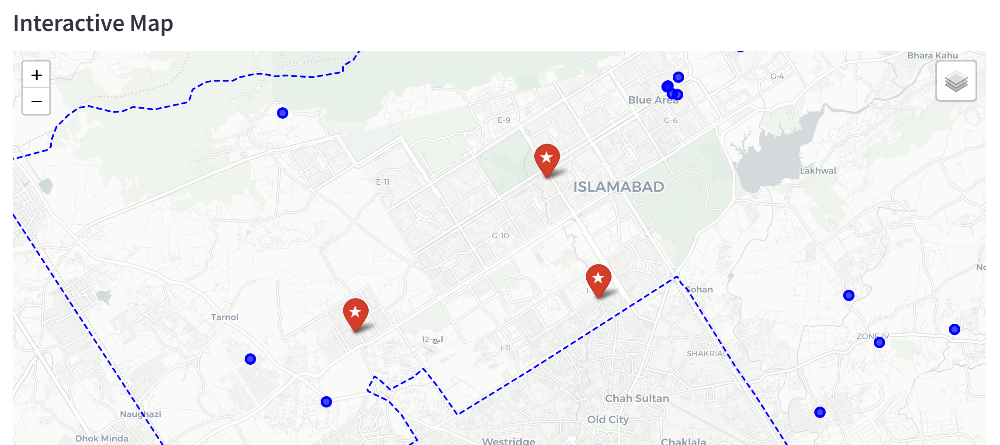

### 🤖 AI-Powered Site Analysis
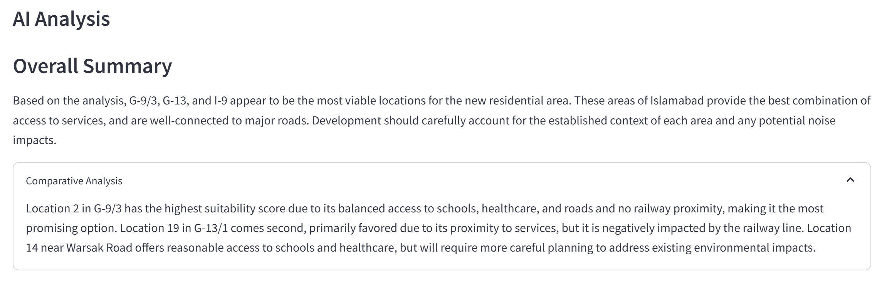

### 🏆 Top 3 Recommended Locations
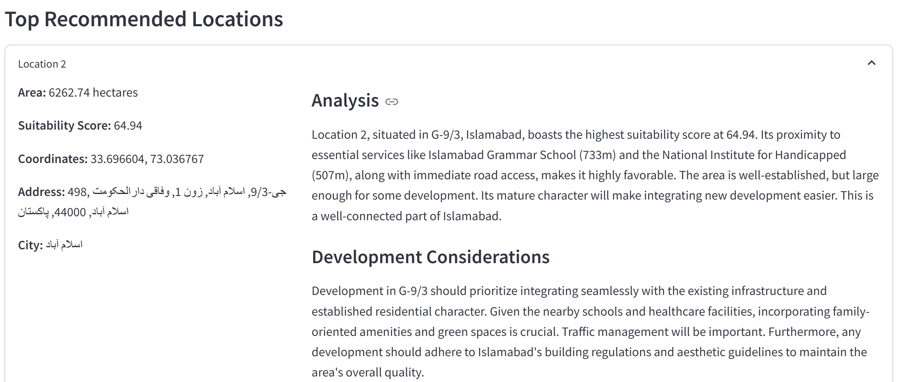

### 🏘️ Nearby Features for Selected Site
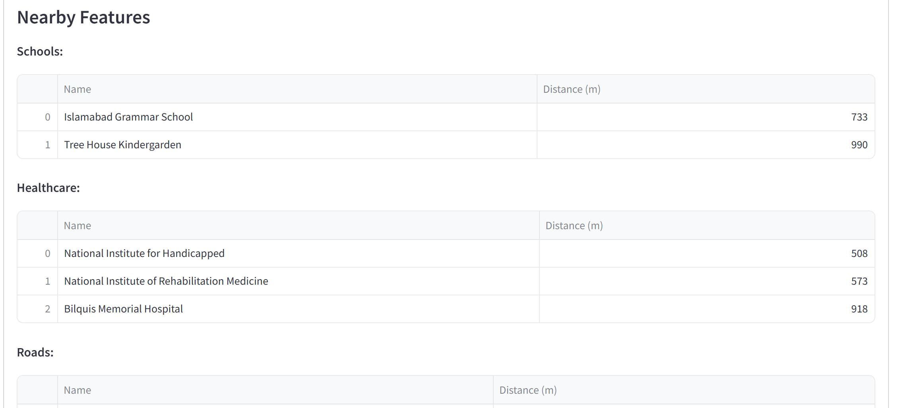

### 🧭 More Nearby Features (Reverse Geocoded)
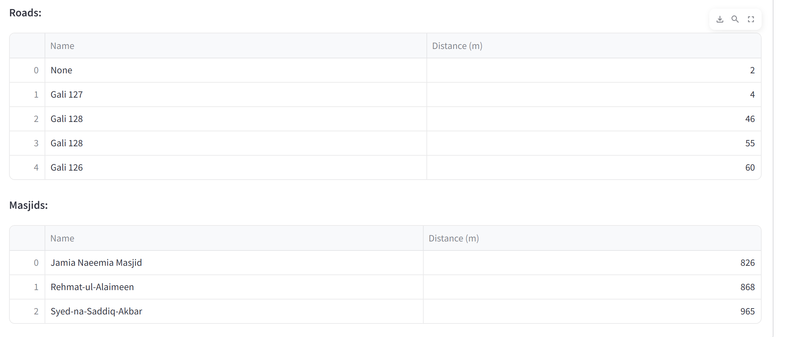

### 🧠 Gemini Explanation Summary
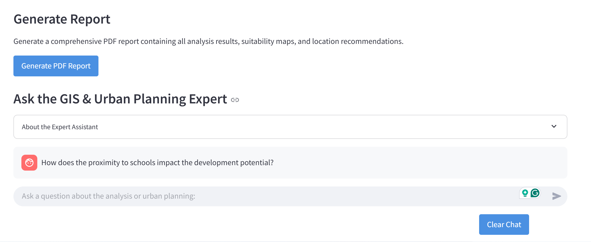

---


## 🎥 Demo Video

[▶️ Watch the Demo on YouTube](https://youtu.be/9YN-82Jp1Rs)

---
>

## 📦 Installation

```bash
# Clone the repository
git clone https://github.com/Noor-e-Fatima/spot-on
cd spot-on

# Create virtual environment
python -m venv venv
source venv/bin/activate  # or venv\Scripts\activate on Windows

# Install dependencies
pip install -r requirements.txt


